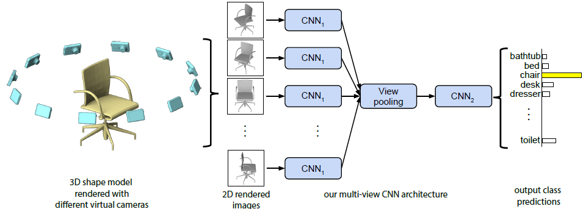

 [](https://www.python.org/downloads/release/python-380/)

This repo contains the work made for the project of ***Bioimages*** course, at the **University of Florence**.

The goal of the project is training a neural network to discriminate between emolitic and lipemic samples of blood, using blood tubes images. 
Given the fact that the dataset is composed from multiple 'views' of same tubes (like frames of different videos), we decided to test a Multi-view CNN model, in particular the one presented in this paper (https://arxiv.org/abs/1505.00880).

<p align="center">
  
</p>

# Environment and packages

In the following paragraph some steps to recreate a usable environment are explained. Conda package manager and Python 3.8 have been used. 

- A usable conda environment can be directly created from the requirements.txt file, using the command:
    
    ``` git conda create --name <env> --file requirements.txt ```

    The requirements.txt file has been exported from an environment on Windows OS, so probably some packages don't correctly fit with different OS. A new conda environment can of course be created, with these commands:

    ```
    conda create --name bioim python=3.8
    conda activate bioim
    conda install pytorch torchvision torchaudio cudatoolkit=11.3 -c pytorch
    conda install -c anaconda -c conda-forge -c comet_ml comet_ml 
    ```
    Pytorch have been used as the machine learning framework. We suggest to look to this [link](https://pytorch.org/get-started/locally/) for different settings. CometML support is present [Comet.ml](https://www.comet.ml/site/), to monitor the training and validation metrics. A registration is needed (you can use the Github account). There are [many ways](https://www.comet.ml/docs/python-sdk/advanced/#python-configuration) to integrate comet support in a project, but we suggest to save the API key generated, as described [here](https://www.comet.ml/docs/quick-start/), in a .comet.config file and to copy the following lines in your script:
    ```
    import comet_ml
    experiment = comet_ml.Experiment()
    ```
    The .comet.config file has to be placed in the folder, where the script is located. In the repo a blank .comet.config file is provided.

# Dataset and labeling creation
The original images have been grouped by data in a folder named 'dataset', with the following hierarchy:
```
dataset                                    
│
├── 15-lug-22
├── 17-feb-22
├── 21-mar-22
├── 27-lug-22
├── 28-feb-22
└── 29,30-mar-22
```

Two ods files contains the labeling for the images, based on data and id information of the tubes. All the logic for labeling is contained in **create_csv.py** script. This a bit hard-coded file, please consider to refactor it, if new samples arrive. The output of the script is a csv with 4 columns: the first contains the data of the shot of the image ('data'), the second the identifier of the tube image ('id'), the third the path to the image ('image'), the last the emolitic/lipemic label ('label').


# File comments

* **dataset.py**: contains the custom dataset class implementation and the function *write_csv_split*. This function create the train/validation split and write out a new csv with an added column 'split', given the original csv created with **create_csv.py**. This 5 columns csv file will be passed as argument to **main.py** script.

* **MVCNN.py**: contains the MVCNN model implementation. The implementation is recovered from (https://github.com/SAMY-ER/Multi-View-Image-Classification/blob/master/network.py). We also implemented a 'small' version of the model in this script.

* **utils.py**: contains a function to get the class distribution of the dataset and a function to show a view (8 images) given the id.

* **roi.py**: this file is useful to find the right roi window for the tubes in the images. Note that for compatibility all the cropped images have been resized to 224x224 when given as input to the net. Consider to change the input size of the net to fit the original dimensions.

* **focal_loss.py**: contains the implementation of the Focal Loss. It has been tested in the experiments because it is considered effective for unbalanced dataset, as our dataset is. 

* **cross_validation.py**: contains cross-validation implementation

* **augmented_lipemic_samples.py**: contains the creation of new lipemic samples using data augmentation, in order to balance the dataset. A csv created with **create_csv.py** (4 columns) is needed as input. The parameters are based on the numerosity of the emolitic and lipemic samples of the dataset. Please consider to change some of them if new samples arrive. 

* **aug_train_lipemic.py**: this file is similar to the previous one, but here we apply data augmentation only on the training samples. We need a previous split csv (5 columns instead of 4) as starting file. 

* **main.py**: contains the training loop logic. Please read inside the file for hyper-parameters documentation.